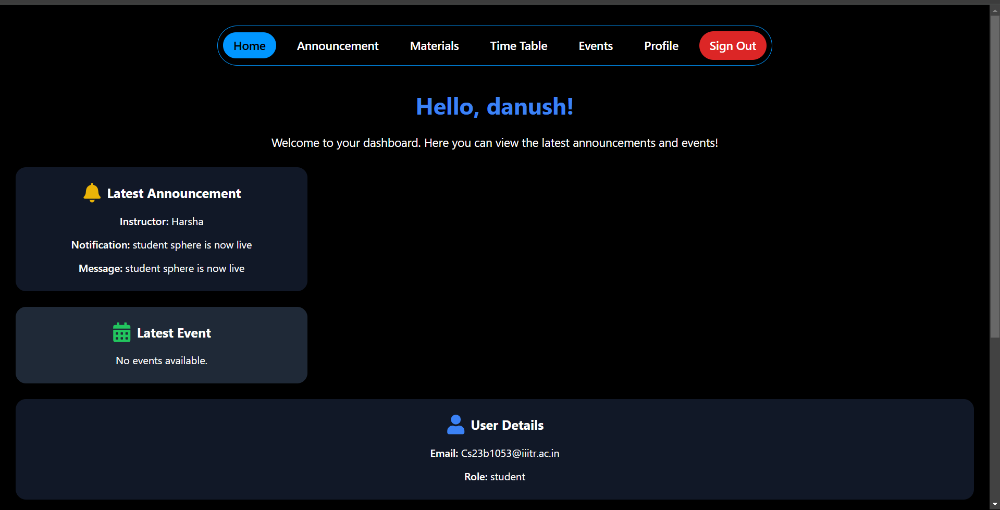

# StudentSphere - The Ultimate Student Portal

## Overview
StudentSphere is a student portal designed to streamline academic, extracurricular, and administrative activities within a university, featuring a user-friendly interface, AI-powered features, and seamless integrations.

## Key Features
- **Home Page:** Personalized dashboard with quick links and a search bar.
- **Announcements Page:** Batch-specific and university-wide announcements.
- **Events Page:** University events with calendar integration.
- **Timetable Page:** Batch-specific schedules with downloadable formats.
- **Profile Page:** Editable student profile and course progress.
- **Light/Dark Mode:** User-preference-based theme switching.
- **Responsive UI:** Optimized for all devices.

### Additional Features
- Customizable dashboard, AI-powered reminders, notifications, feedback & query system, gamification, and multi-language support.
- **Offline Access:** Limited access to timetable and announcements.

## Tech Stack
- **Frontend:** Next.js, TypeScript, Tailwind CSS
- **Backend:** Firebase (Authentication, Firestore Database)
- **AI & Automation:** Chatbot with NLP, AI-powered reminders

## Installation
1. Clone the repo:
   ```sh
   git clone https://github.com/your-repo/studentsphere.git
   cd studentsphere
   ```
2. Install dependencies:
   ```sh
   npm install
   ```
3. Set up `.env.local` and run:
   ```sh
   npm run dev
   ```

## Screenshots




## Contribution
1. Fork the repository and create a feature branch.
2. Commit and push your changes.
3. Open a pull request.

## License
MIT License.

## Contact
- **Email:** cs23b1034@iiitr.ac.in
- **GitHub Issues:** [GitHub Issues](https://github.com/Kvj-Harsha/studentsphere/issues)

---

StudentSphere - Empowering Students, Simplifying Campus Life.
